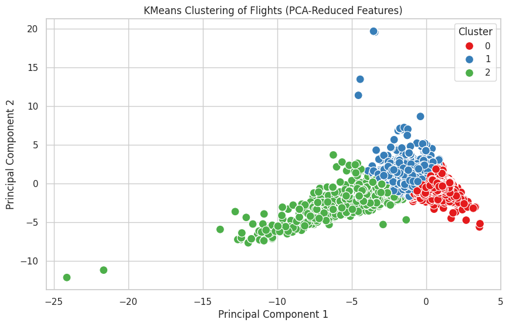
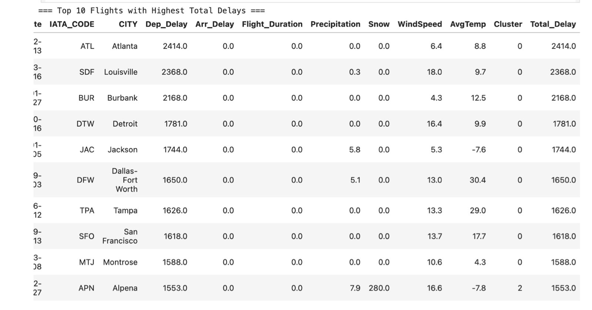

# Airport Placement Optimization- DSA210 Project

## Project Overview
In this project, I’ll analyze air traffic and airport congestion to explore where new airports are most needed in busy airspaces. By examining flight density, delays, and capacity data, I aim to identify key bottlenecks and their causes. Using data visualization and machine learning, I plan to highlight the most overloaded airports and suggest optimal locations for new ones. My goal is to provide data-driven insights that improve air traffic flow and support smarter airport planning.

---

## Objectives
1. **Understand Air Traffic Patterns and Bottlenecks**
   
    Explore the relationship between air traffic density, airport delays, airspace congestion, airport capacity, and flight distribution to understand how and where congestion impacts
   flight efficiency.

2. **Identify Critical Regions for New Airport**
   
   Identify the most congested airspaces and where a new airport could best reduce delays and improve traffic flow.
   
 3. **Data-Driven Infrastructure Planning**

    Use traffic and delay data to recommend ideal sites for new airports, enabling data-driven solutions for more efficient air traffic and urban planning."

4. **Apply Data Science Methodologies**
   
     Apply the data collection, analysis, visualization, and machine learning techniques learned in DSA 210 to address a complex, real-world aviation problem, enhancing both technical
   and analytical skills.

---

## Motivation 

This project consists multi-diciplinear area which I interested and this project might solve aviation and daily life problem. 

-**Problem Solving**

Delays and overcrowding at airports are challenging issues that affect everyone. This daily problem motivated me to focus on this project and explore data-driven solutions to improve 
air traffic efficiency.

-**Personal Interest**

Aviation has always fascinated me—not just from a technological perspective, but also in terms of the complex systems that keep global travel running smoothly. Exploring how data can 
solve real challenges in air traffic gives me a chance to dive deeper into a field I care about.

-**Application Of Class**

This project allows me to apply everything I’ve learned in DSA 210 to a real-world, high-impact problem. It’s an opportunity to turn theoretical knowledge into practical insights that 
could influence future infrastructure decisions.

-**Increasing Efficietcy**

Beyond the scope of this project, I’m motivated by the potential of data science to contribute to smarter, more sustainable urban and transportation planning. I hope my work here can 
be a small step toward making air travel more efficient and accessible.

---

## Dataset

This project utilizes real-world datasets to analyze air traffic congestion and explore the need for new airport locations. Below are the key datasets I will be working with:

**Flight Records and Delays:**

maj us flight - january 2024.csv: Detailed U.S. flight data for January 2024, including flight times, routes, delays, and cancellations.
Cancelled_Diverted_2023.csv: Records of canceled and diverted flights across 2023 to identify operational bottlenecks and airspace issues.

**Airport Geolocation and Capacity Data:**

airports_geolocation.csv: Geographical coordinates of airports to analyze spatial distribution and gaps in service.
airports.csv: Full list of airports with additional metadata for capacity and classification.

**Airline Information:**

airlines.csv: Information on airline operators to assess traffic concentration and airline-specific delays.

**Passenger Statistics:**

Air_Traffic_Passenger_Statistics.csv: Passenger flow data to understand airport demand and usage patterns.

**Weather Data:**

weather_meteo_by_airport.csv: Weather conditions (e.g., wind, precipitation, visibility) at different airports to analyze their impact on delays and congestion.

---

## How the Data Will Be Used
Each dataset is utilized to answer a specific research question about U.S. airport congestion and flight delays. Below is a breakdown of how 
the data contributes:

## 1. Flight Performance Data — final_enriched_airport_dataset.csv
• Purpose:
Identify patterns of congestion and delay based on flight activity and scheduling.
• Usage:

Calculate departure and arrival delays

Create a binary is_congested flag

Provide features for classification and clustering

## 2. Weather Conditions by Airport — weather_meteo_by_airport.csv
• Purpose:
Quantify the effect of meteorological conditions on delays.
• Usage:

Merge with flight data using IATA_CODE and FlightDate

Use weather variables such as Precipitation, Snow, WindSpeed, and AvgTemp

Enable weather-aware flight clustering

## 3. Airport Metadata — airports.csv and airports_geolocation.csv
• Purpose:
Enhance interpretability of results through contextual and geographic airport information.
• Usage:

Map IATA_CODE to airport name and city

Add readable labels in outputs (e.g., for most delayed flights by cluster)

## Exploratory Data Analysis (EDA)

To understand the flight delay dataset before applying machine learning or testing hypotheses, we conducted a thorough exploratory data analysis. This included examining delay trends across cities, airlines, weather conditions, and operational features such as flight time, distance, and daily/seasonal effects.

### 1. Data Quality and Missing Values
The dataset was checked for missing values in key fields such as weather conditions (*precipitation, snow, wind speed, temperature*), delay components (*carrier, NAS, weather, security, last aircraft*), and timestamps.  
➡️ Rows with missing values in selected features were excluded from modeling to ensure clustering accuracy.

---

### 2. Outlier Detection
Boxplots of departure delays by distance category revealed a large number of extreme outliers — especially in **short and medium haul** flights.  
➡️ Delays exceeding **1000 minutes** were retained, as they represent real operational disruptions rather than data errors.

---

### 3. Delay Distribution & Skewness
Delay data exhibited significant **right skew**.  
➡️ Most flights experienced minimal or no delay, but a small subset showed **extreme delays**.  
➡️ This pattern was consistent across visualizations (by **airline**, **city**, **weather**) and highlights the importance of modeling tail behaviors.

---

### 4. Summary of Key Patterns

- **Time of Day**: Afternoon flights tend to have the **highest average delays**, suggesting compounding delays throughout the day.
- **Top Delay Cities**: Airports in smaller or less connected cities (e.g., *Alpena, MI* and *Pellston, MI*) experienced the **longest average departure delays**.
- **Delay Causes**: Delays due to **last aircraft arrival** and **NAS (National Airspace System)** were the **most significant contributors**.
- **Weather Impact**: Surprisingly, the **highest delays** were observed in **low precipitation conditions** (0–0.1 inch), possibly due to **indirect operational factors**.
- **Airlines & Airports**: Airlines like **JetBlue Airways** and airports like **ATL** and **MCO** showed **consistently high delay metrics**.
- **Flight Volume Correlation**: A **weak negative correlation** was observed between number of flights and average delay — high-volume hubs may manage delays more efficiently.
- **Diverted Flights**: Roughly **15.8% of flights** were diverted, as shown in the pie chart visualization.

---

## Data Visualization

To gain further insight into flight delays, we visualized key relationships and airport-specific patterns. Below are summaries of the generated figures and the interpretations derived from them.

---

### **Figure 1: Departure Delay by Time of Day**

.png)

This line chart shows how departure delays vary throughout the day.

- **Insight**: Flights departing in the **afternoon** experience the **highest average delays**, indicating possible cumulative congestion as the day progresses.

---

### **Figure 2: Top 10 Departure Cities by Avg Delay**

.png)

This horizontal bar chart displays the top cities with the highest average departure delay.

- **Insight**: Smaller regional airports like **Alpena, MI** and **Pellston, MI** have significantly higher delays, possibly due to limited infrastructure or low flight frequency buffers.

---

### **Figure 3: Average Delay Duration by Cause**

.png)

This bar chart compares the average delay times attributed to various causes.

- **Insight**: **NAS (National Airspace System)** delays and **Late Arrival of Aircraft** dominate the overall delay structure, suggesting upstream propagation of scheduling inefficiencies.

---

### **Figure 4: Average Departure Delay by Precipitation Level**

.png)

This chart examines the relationship between precipitation levels and departure delay.

- **Insight**: Surprisingly, the **highest delays occurred under low precipitation conditions (0–0.1 inches)**, hinting at non-linear relationships or hidden confounders like visibility or traffic volume.

---

### **Figure 5: Average Delay Components by Top 10 Airports**

.png)

A grouped bar chart shows delays by type at the busiest airports.

- **Insight**: **ATL** and **MCO** display consistently high delays, especially due to NAS and carrier issues, reflecting high operational pressure in major hubs.

---

### **Figure 6: Average Departure Delay vs. Flight Volume**

.png)

This scatter plot shows average delays against number of flights per airport.

- **Insight**: A **weak negative correlation** suggests that **larger airports** may manage congestion better through more robust infrastructure and scheduling systems.

---

### **Figure 7: Diverted Flight Rate**

.png)

This pie chart illustrates the percentage of diverted flights.

- **Insight**: **15.8% of all flights were diverted**, indicating a substantial operational risk factor that may be weather- or congestion-related.

---

### **Figure 8: Average Departure Delay by Airline**

.png)

This bar chart compares delay averages across major airlines.

- **Insight**: Airlines such as **JetBlue** and **American Airlines** show higher delays, potentially due to tighter turnarounds, regional route structures, or maintenance scheduling issues.

---

### **Figure 9: Daily Average Departure Delay Trend**

.png)

This time series tracks daily average delay fluctuations across the year.

- **Insight**: Spikes in **early spring and late fall** indicate **seasonal bottlenecks**, likely tied to holiday or weather-related congestion.

---

### **Figure 10: Departure Delay by Distance Category**

.png)

A box plot of departure delay segmented by flight distance.

- **Insight**: Short and medium haul flights exhibit **more extreme outliers**, suggesting higher unpredictability in shorter connections.

---

### **Figure 11: Top 10 Airports with Long Delays During Heavy Rain**

.png)

This bar chart ranks airports by delay duration under **>1.0 inch precipitation**.

- **Insight**: Airports like **APN**, **PLN**, and **BOI** suffer extreme delays under heavy rain, revealing vulnerability in adverse weather conditions.

## Hypothesis Testing

To investigate statistically significant patterns behind flight delays, four hypothesis tests were conducted. These tests aimed to identify the impact of weather, airport traffic, and cancellations on average departure delays.

---

### **Test 1: Impact of Rainfall on Departure Delay**

.png)

- **Objective**: Assess whether average delays differ significantly between rainy days (precipitation > 1.0 inch) and dry days.
- **Test Used**: Mann–Whitney U Test (non-parametric)
- **Sample Size**:  
  - Rainy Days: 45,506 flights  
  - Dry Days: 49,342 flights  
- **Normality**: Both groups failed the Shapiro-Wilk test  
- **Variance**: Levene’s Test p = 1.48e⁻¹² ⇒ variances are unequal  
- **Result**: p-value = **0.00015**

**Conclusion**:  
There is a statistically significant difference in delays between rainy and dry days. Delays tend to be higher during rainy days, confirming the operational impact of precipitation on flight punctuality.

---

### **Test 2: Airport Traffic vs. Departure Delay**

.png)

- **Objective**: Determine whether airports with higher flight volume experience greater average delays.
- **Test Used**: Pearson Correlation
- **Result**:  
  - Pearson r = 0.0024  
  - p-value = 0.9657

**Conclusion**:  
There is **no significant correlation** between the number of flights and average delay. High traffic volume alone does not predict increased delays. Infrastructure efficiency likely plays a larger role.

---

### **Test 3: Passenger Load vs. Departure Delay**

.png)

- **Objective**: Assess if higher passenger loads are linked with longer delays.
- **Test Used**: Pearson Correlation  
- **Result**:  
  - Pearson r = 0.0023  
  - p-value = 0.9667

**Conclusion**:  
There is **no significant linear correlation** between passenger volume and departure delays. Delay patterns are more influenced by operational factors than passenger numbers.

---

### **Test 4: Cancellation vs. Departure Delay**

.png)

.png)

- **Objective**: Determine if flights that are eventually cancelled show significantly higher average delays before cancellation.
- **Test Used**: Welch’s t-test  
- **Result**:  
  - t-statistic = -41.166  
  - p-value < 0.001

**Insight**:  
Approximately **15.8% of flights** were diverted, highlighting a substantial source of operational disruption that may tie into weather, traffic, or emergency protocols.

**Conclusion**:  
Cancelled flights show **significantly higher departure delays** prior to cancellation. These results support using delay metrics as early indicators of cancellation risk.

##  Machine Learning Analysis

To uncover hidden patterns in flight delay conditions, we applied unsupervised machine learning techniques — **Principal Component Analysis (PCA)** and **KMeans Clustering** — on standardized environmental and delay variables.

---

###  Methodology

- **Selected Features**:
  - `Dep_Delay`: Departure delay (min)
  - `Arr_Delay`: Arrival delay (min)
  - `Precipitation`, `Snow`, `WindSpeed`, `AvgTemp`

- **Pipeline**:
  - All features were **standardized**.
  - **PCA** reduced them to 2 components explaining ~93% of total variance.
  - **KMeans** clustered flights into **3 operational categories**.

---

###  Cluster Interpretation

| Cluster | Description                      | Pattern |
|---------|----------------------------------|---------|
| **0**   | Extreme delays                   | Delay > 2000 min, often dry and calm weather |
| **1**   | Moderate delays                  | Mild environmental disruption (e.g. wind, light rain) |
| **2**   | Stable flights                   | Normal ops, low delay, extreme weather possible |

---

###  Figure 1 — PCA Clustering of Flights  

The PCA scatter plot visualizes clusters:
-  **Cluster 0** (rightmost): Severe delays.
-  **Cluster 1** (center): Moderate delays.
-  **Cluster 2** (leftmost): Normal flights, even with adverse weather.

---

###  Sample Flights by Cluster

#### Cluster 0 — Extreme Delays (e.g., systemic failures)

| FlightDate | IATA | City      | Dep_Delay | Precip | Snow | Wind | Temp  |
|------------|------|-----------|-----------|--------|------|------|-------|
| 2023-01-11 | ABE  | Allentown | 0         | 0.0    | 0.0  | 9.0  | 2.3   |
| 2023-01-11 | ABE  | Allentown | -11.0     | 0.0    | 0.0  | 9.0  | 2.3   |
| 2023-03-31 | ABE  | Allentown | 0.0       | 0.3    | 0.0  | 7.2  | 3.8   |

####  Cluster 1 — Moderate Disruptions

| FlightDate | IATA | City      | Dep_Delay | Precip | Snow | Wind | Temp  |
|------------|------|-----------|-----------|--------|------|------|-------|
| 2023-01-12 | ABE  | Allentown | -5.0      | 4.1    | 0.0  | 11.2 | 4.1   |
| 2023-01-22 | ABE  | Allentown | 0.0       | 9.1    | 0.0  | 10.1 | 2.1   |
| 2023-02-24 | ABE  | Allentown | -9.0      | 0.0    | 0.0  | 19.4 | 6.4   |

####  Cluster 2 — Severe Weather, No Delay

| FlightDate | IATA | City      | Dep_Delay | Precip | Snow  | Wind | Temp   |
|------------|------|-----------|-----------|--------|-------|------|--------|
| 2023-01-03 | ABR  | Aberdeen  | 0.0       | 0.0    | 180.0 | 20.5 | -10.2  |
| 2023-01-04 | ABR  | Aberdeen  | 0.0       | 0.0    | 180.0 | 23.0 | -6.2   |
| 2023-02-22 | ABR  | Aberdeen  | 0.0       | 4.3    | 200.0 | 40.3 | -17.4  |

---

### 🔟 Figure 2 — Top 10 Most Delayed Flights  

Flights with extreme delays (up to **2414 minutes**) are mostly assigned to **Cluster 0**.

---

---

###  Extended Interpretation

####  Cluster Characteristics Overview

| Cluster | Avg. Departure Delay | Avg. Wind Speed | Avg. Temp (°C) | Precipitation/Snow | Notable Cities     | Interpretation |
|---------|----------------------|------------------|----------------|---------------------|---------------------|----------------|
| **0**   | 1812.5 min           | 11.4 km/h        | 9.4            | Low                 | ATL, SDF, DFW       | **Severe delays in calm/dry weather** — points to **operational/systemic issues**, not meteorological causes. |
| **1**   | -4.6 min             | 14.2 km/h        | 6.1            | Mild/Moderate rain  | ABE, TPA, SFO       | **Moderate delays**, generally linked to **mild weather disruptions** such as wind or light rain. |
| **2**   | 0.0 min              | 24.1 km/h        | -10.5          | High snow & wind    | ABR, APN, MTJ       | **No delays despite extreme snow & wind**, shows **high airport resilience** and infrastructure reliability. |

---

####  Cluster Patterns and Operational Insights

- **Cluster 0 (High Delay, Calm Weather)**  
  Flights in this cluster show extreme delays (**> 1500 minutes**) despite minimal precipitation or wind. This suggests **non-weather-related causes** such as:
  - Ground crew shortages
  - Mechanical failures
  - Runway congestion or air traffic control inefficiencies  
  Cities like **Atlanta (ATL)** and **Louisville (SDF)** frequently appear here — **potential targets for operational audits**.

- **Cluster 1 (Moderate Delays, Moderate Weather)**  
  Delays are modest and frequently coincide with **mild disturbances**, such as wind or light rain. Flights in this group may benefit from:
  - Improved predictive weather scheduling
  - Flexible routing or real-time adjustments  
  These delays are **likely weather-induced but manageable** with proper contingency planning.

- **Cluster 2 (No Delay, Harsh Weather)**  
  Despite **extreme conditions** (e.g., wind > 40 km/h, snow > 180 mm), flights in this cluster **proceeded on schedule**. Airports like **Aberdeen (ABR)** and **Alpena (APN)** stand out for:
  - Strong infrastructure
  - Deicing systems, snow clearance, and resilient scheduling  
  This cluster reveals **best practices** that could inform underperforming hubs.

---

####  Implications for Delay Management

-  **Cluster 0** indicates a need for **non-weather operational improvements** — such as staffing, equipment, and scheduling.
-  **Cluster 1** encourages **weather-aware optimizations** — buffering slots, enhancing comms, and staff readiness.
-  **Cluster 2** exemplifies **effective performance under stress** — ideal models for scalable, weather-resistant operations.

---

####  Strategic Value of Clustering

This unsupervised clustering:
- Helps differentiate **avoidable delays** from **inevitable ones**.
- Enables **airport benchmarking**: Which cities struggle under low stress? Which succeed in extreme conditions?
- Supports **automated alerting systems** by labeling new flight entries based on delay-risk clusters.

> 🔍 In sum, the clustering reveals **hidden structures** in delay causality — allowing airport operators and policymakers to target interventions more precisely.

---

---

###  Cluster Validation with Total Delay Score

To assess the quality of clustering, we examined how well each cluster aligned with actual **total delay durations** — although this feature was **not used during clustering**, it serves as an independent validation metric.

| Cluster | Avg. Total Delay (min) |
|---------|------------------------|
| **0**   | 1886.4                 |
| **1**   |  4.2                   |
| **2**   |  0.0                   |

---

This outcome confirms that the unsupervised clustering successfully differentiated flights by **true delay severity**:

-  **Cluster 0** has the highest average total delay — validating that it captures **critical outlier cases** with operational failures.
-  **Cluster 1** shows moderate delays — consistent with **weather-related slowdowns**.
-  **Cluster 2**, despite harsh conditions (e.g., snow > 180mm, wind > 40 km/h), still exhibits **no delay**, proving it represents **resilient operations**.

> The clustering method — based only on environmental and delay-related features — **effectively uncovered latent patterns** and successfully stratified flight operations into risk tiers.

---

###  Conclusion

- Clustering separated flights with meaningful delay/weather patterns.
- Cluster 2 flights experienced **no delays** despite **extreme snow/wind** — showing **operational resilience**.
- Cluster 0 concentrated **major disruptions**, useful for **risk monitoring or intervention planning**.

> This unsupervised approach enables scalable anomaly detection and risk-aware air traffic analytics.

---

###  Future Outlook

This project demonstrates the potential of combining unsupervised learning with environmental and operational data to uncover meaningful patterns in flight delays. While the current implementation focuses on clustering historical flight data using PCA and KMeans, there are numerous promising directions for future extension and application.

#### ✈ Real-Time Delay Prediction

One of the most impactful extensions would be transforming this project into a **real-time predictive system**. By training supervised models (e.g., Random Forests, XGBoost) using the clustered labels as targets, we can forecast whether a new flight — given its environmental and scheduling conditions — is likely to belong to a "high delay risk" cluster. This would support:

- **Dynamic rescheduling** of flights
- **Proactive gate allocation**
- **Airline-side interventions** like standby crews or aircraft rotation

####  Geospatial Delay Risk Mapping

With geolocation data integrated (latitude-longitude of origin/destination airports), the clusters can be visualized on an **interactive map**, offering insights into:

- **Regional vulnerabilities** (e.g., snow-prone Midwest airports vs. hurricane-exposed Southeast hubs)
- **Infrastructure pressure points**
- **Climate-related exposure**

This could be especially useful for **airport administrators, civil aviation authorities, or insurance providers**.

#### Operational Efficiency Analysis

By tracking how environmental stress translates into delays at different airports or under different airline operators, this clustering framework can:

- Identify **best practices** among airlines with minimal delays under severe conditions
- Reveal **inefficiencies** in specific airspace sectors or under particular traffic volumes
- Quantify how **weather-resilience investments** (e.g., de-icing systems, better ATC) affect operational performance

####  Temporal Evolution of Delay Behavior

Future work can incorporate **time-series modeling** (e.g., clustering by month or year) to analyze:

- How delay clusters evolve in response to climate variability
- The impact of **policy changes** (e.g., FAA directives, COVID restrictions)
- Identification of **long-term trends** in delay resilience or vulnerability

Example:
> A flight route that belonged to a "moderate delay" cluster in 2018 might shift to a "severe delay" cluster in 2023, reflecting changing air traffic loads or weather patterns.

####  Integration with Other Datasets

The pipeline could be expanded with:

- **Flight route complexity metrics**
- **Passenger volume/load factors**
- **Airport traffic capacity**
- **Weather radar and satellite data**

This would enable **multi-dimensional risk modeling**, bringing your work closer to tools used in airline operations research and logistical optimization.

####  Towards Policy and Infrastructure Planning

The findings from this project can inform:

- **Runway expansion prioritization** at high-risk airports
- **Early warning systems** for expected delay-heavy seasons
- **Strategic investments** in backup power, snow removal, and air traffic automation

These insights could support collaboration between:
- **Federal aviation bodies (FAA, EASA)**  
- **Airport authorities**
- **Private airlines**
- **Urban planners** aiming to improve airport accessibility and resilience

---

>  **In summary**, this project opens the door to building an **intelligent, explainable, and modular air traffic analytics system**. Its core clustering method serves as a backbone for scalable anomaly detection, resource planning, and data-driven decision support — critical needs for the future of efficient and resilient air travel.

---

